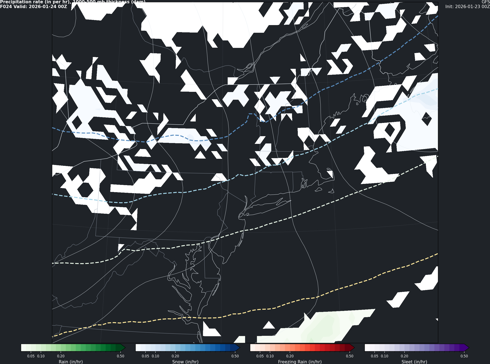
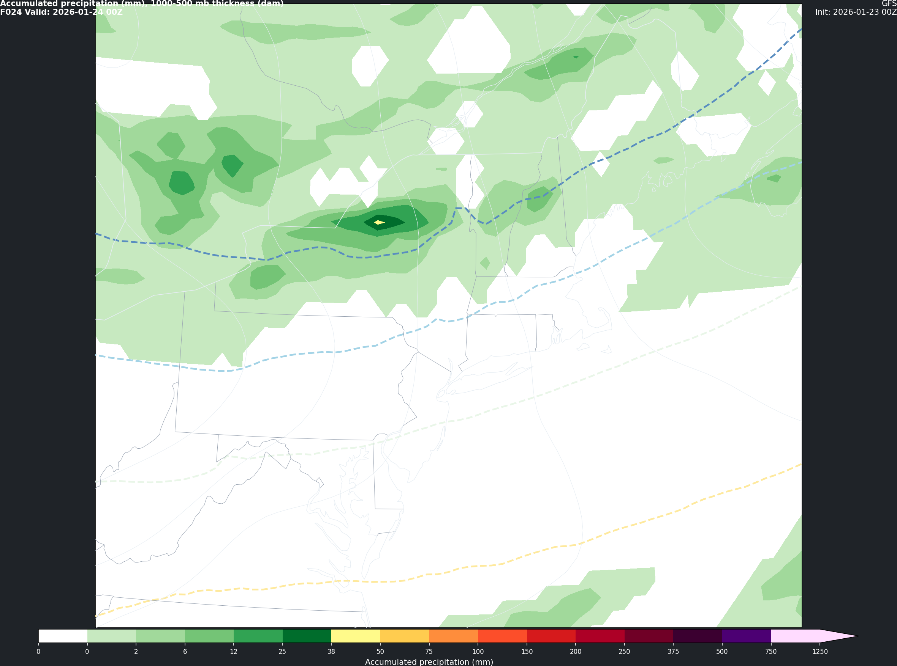

# SynopticCharts (CLI)

SynopticCharts generates synoptic-style charts and forecast videos from supported numerical weather prediction models.

## Supported models

- **GFS** (Global Forecast System) — max lead: **384h**
- **ECMWF** (ECMWF deterministic / open data feed) — max lead: **240h**

## Supported chart types

- **Precip rate**: precipitation rate + 1000–500 mb thickness + MSLP + surface H/L markers
- **Accumulated precip**: init-to-lead accumulated precipitation (mm) + 1000–500 mb thickness + MSLP + surface H/L markers
- **Side-by-side video**: GFS vs ECMWF stitched into one MP4

## Install

```bash
pip install synoptic-charts
```

For MP4 generation (requires `ffmpeg` on your system):

```bash
pip install "synoptic-charts[video]"
```

## Examples (CLI)

### 1) Single chart

```bash
synoptic-charts chart \
  --model GFS \
  --cycle 2026012300 \
  --lead-time 24 \
  --region NORTHEAST \
  --background-color "#1f2328" \
  --output docs/images/example_gfs_rate.png
```

Accumulated precip version (same lead time, mm):

```bash
synoptic-charts chart \
  --model GFS \
  --cycle 2026012300 \
  --lead-time 24 \
  --region NORTHEAST \
  --config docs/accumulated.yaml \
  --background-color "#1f2328" \
  --output docs/images/example_gfs_accum.png
```

### 2) Forecast videos (single model)

Produces both **rate** and **accumulated** videos by default:

```bash
synoptic-charts forecast-video \
  --model GFS \
  --cycle 2026012300 \
  --region NORTHEAST \
  --interval 6 \
  --max-lead 72 \
  --background-color "#1f2328"
```

Silence most output (prints only final output path(s)):

```bash
synoptic-charts --silent forecast-video \
  --model GFS \
  --cycle 2026012300 \
  --region NORTHEAST \
  --max-lead 72
```

### 3) Side-by-side comparison video (GFS vs ECMWF)

```bash
synoptic-charts forecast-video \
  --model compare \
  --cycle 2026012306 \
  --region NORTHEAST \
  --interval 6 \
  --max-lead 120 \
  --background-color "#1f2328"
```

Notes:
- ECMWF typically runs at 00Z/12Z; if you request 06Z, the CLI aligns cycles using `--align-ecmwf` / `--align-gfs`.
- For GFS, available lead times change at longer ranges; the CLI filters requested lead times to those actually available.

## Regions (changing extents)

`--region` selects a preset from `REGIONS`.

- Built-in presets live in [synoptic_charts/constants.py](synoptic_charts/constants.py)
- Each region defines an `extent = [west, east, south, north]` (degrees) and projection parameters

To add/adjust a region preset, edit/add an entry in `REGIONS`.

## Example images

Precip rate example:



Accumulated precip example:



## Runtime expectations

Runtime depends heavily on cache state and network speed.

A rough way to estimate runtime is:

- $\text{total time} \approx \text{frames} \times \text{seconds per frame}$

Frame counts at max lead depend on the model lead-time list:

- **GFS to 384h**: 0–240 every 3h, then 240–384 every 12h (≈105 frames)
- **ECMWF to 240h**: 0–144 every 3h, then 144–240 every 6h (≈65 frames)

On a typical laptop:
- **Warm cache** (GRIBs already downloaded): often a few seconds per frame.
- **Cold cache**: downloads dominate and can be much slower.

Tips to reduce wall-clock time:
- Use `--workers` (and don’t pass `--no-parallel`) for rate-mode runs.
- Use larger `--interval` (e.g. 6 or 12) for fewer frames.

## License

MIT License. See [LICENSE](LICENSE).

## Future work

(TBD)
