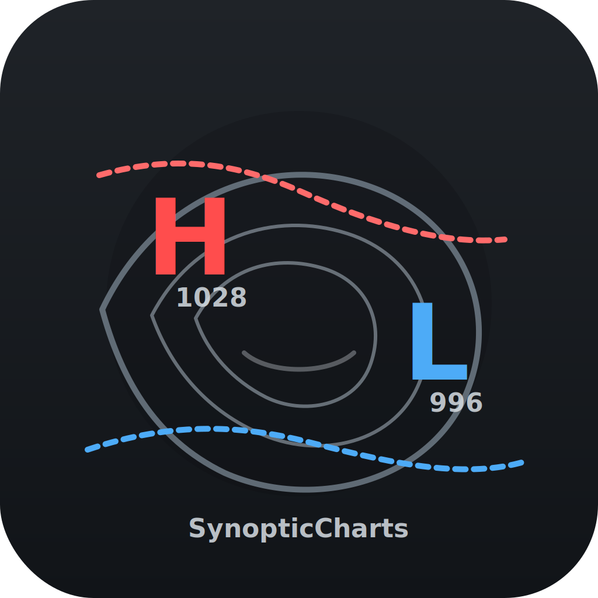

# SynopticCharts



**Lightweight Python package for creating synoptic-style meteorological charts**

For CLI-first usage (recommended), see [CLI_README.md](CLI_README.md).

SynopticCharts is a modern Python package that automates the creation of synoptic meteorological charts from numerical weather prediction model data. It combines automated data retrieval, meteorological analysis, and publication-quality visualization—so your attention stays on the atmosphere, not on file formats.

## Features

- **Automated Model Data Download**: Seamlessly retrieve forecast data from GFS and ECMWF models via herbie-data
- **MSLP Analysis**: Generate mean sea level pressure contours with automatic surface feature detection (High/Low markers)
- **Multi-Type Precipitation Visualization**: Display rain, snow, freezing rain, and sleet with type-specific color schemes
- **1000-500mb Thickness Analysis**: Create atmospheric thickness charts for temperature structure analysis
- **Professional Meteorological Styling**: Industry-standard map projections, contour intervals, and annotations
- **Video Generation**: Create animated forecast sequences from multiple time steps (requires optional video dependencies)

## Installation

### Basic Installation

```bash
pip install synoptic-charts
```

### Development Installation

Clone the repository and install in editable mode with development tools:

```bash
git clone https://github.com/krober10nd/synoptic-charts.git
cd synoptic-charts
pip install -e ".[dev]"
```

### Video Support

For MP4 generation capabilities:

```bash
pip install synoptic-charts[video]
```

### Requirements

- Python 3.10 or higher
- All dependencies are automatically installed via pip

## Quick Start

### Single Chart Generation

Create a single synoptic chart with minimal code:

```python
from synoptic_charts import create_chart
from datetime import datetime

# Generate a 24-hour GFS forecast chart
create_chart(
    model="GFS",
    forecast_cycle=datetime(2024, 1, 15, 0),  # 2024-01-15 00Z cycle
    lead_time=24,  # 24-hour forecast
    output_path="chart.png"
)
```

### Batch Video Generation

Create an animated forecast sequence:

```python
from synoptic_charts import BatchChartGenerator, create_video_from_batch
from datetime import datetime

# Initialize batch generator
batch = BatchChartGenerator(
    model="GFS",
    forecast_cycle=datetime(2024, 1, 15, 0),
    output_dir="frames",
    parallel=True,  # Enable parallel processing
    max_workers=4
)

# Generate frames for 0-48 hour forecast (3-hour intervals)
batch_result = batch.generate_forecast_sequence(
    start_hour=0,
    end_hour=48,
    interval=3
)

# Create video from frames
create_video_from_batch(
    batch_result=batch_result,
    output_path="forecast.mp4",
    fps=10
)

# Optionally cleanup frames after video creation
# batch.cleanup_frames()
```

### Command-Line Interface

SynopticCharts includes a comprehensive CLI:

```bash
# Generate a single chart
synoptic-charts chart GFS 2024011500 24 --output chart.png

# Generate batch frames
synoptic-charts batch GFS 2024011500 --start 0 --end 48 --interval 3 --output frames

# Create video from frames
synoptic-charts video frames/frame_%03d.png --output forecast.mp4 --fps 10

# Combined workflow (batch + video)
synoptic-charts animate GFS 2024011500 --start 0 --end 48 --interval 3 --output animation.mp4
```

See the [examples directory](examples/) for more detailed usage examples.

## Configuration

Customize chart appearance and behavior using the `Config` class:

```python
from synoptic_charts import Config

# Create custom configuration
config = Config(
    default_dpi=300,  # High resolution output
    figure_width=20.0,
    figure_height=15.0,
    mslp_contour_interval=2.0,  # 2 hPa intervals for fine detail
    thickness_contour_interval=3.0  # 30 meter intervals
)

# Save configuration for reuse
config.save_to_file("my_config.yaml")

# Load and use saved configuration
config = Config.load_from_file("my_config.yaml")
create_chart(..., config=config)
```

See the [configuration guide](docs/configuration.md) for comprehensive documentation of all parameters.

## Usage Examples

### Custom Regions

Create charts for specific geographic regions:

```python
from synoptic_charts import create_chart, REGIONS
from datetime import datetime

# Use built-in CONUS region (default)
create_chart(
    model="GFS",
    forecast_cycle=datetime(2024, 1, 15, 0),
    lead_time=24,
    output_path="conus.png",
    region="CONUS"  # This is the default
)

# Define custom Southeast region and add to REGIONS
southeast_region = {
    "name": "Southeast US",
    "extent": [-90.0, -75.0, 25.0, 37.0],  # [W, E, S, N]
    "projection_params": {
        "central_longitude": -82.5,
        "central_latitude": 31.0,
        "standard_parallels": (27.0, 35.0),
    },
    "figure_size": (12, 10)  # width, height in inches
}

# Add to REGIONS dictionary for reuse
REGIONS["SOUTHEAST"] = southeast_region

create_chart(
    model="GFS",
    forecast_cycle=datetime(2024, 1, 15, 0),
    lead_time=24,
    output_path="southeast.png",
    region="SOUTHEAST"
)
```

### Working with Existing Data

Use pre-downloaded data instead of fetching from servers:

```python
from synoptic_charts import ModelDownloader, create_chart_from_data, Config
from datetime import datetime, timedelta


def get_recent_forecast_cycle():
    now = datetime.utcnow()
    cycle_hour = (now.hour // 6) * 6
    return datetime(now.year, now.month, now.day, cycle_hour) - timedelta(hours=6)

# Download data once
forecast_cycle = get_recent_forecast_cycle()
lead_time = 24

downloader = ModelDownloader(
    model_name="GFS",
    init_time=forecast_cycle,
    forecast_hour=lead_time,
    config=Config(),
)
data_dict = downloader.fetch_all_data()

# Create multiple charts with different settings without re-downloading
create_chart_from_data(
    data_dict=data_dict,
    model_name="GFS",
    init_time=forecast_cycle,
    valid_time=forecast_cycle + timedelta(hours=lead_time),
    lead_time=lead_time,
    output_path="chart.png"
)
```

### Validating Forecast Times

Check available lead times before generating charts:

```python
from synoptic_charts import get_available_lead_times

# Get valid forecast hours for GFS
lead_times = get_available_lead_times("GFS")
print(f"GFS provides forecasts: {lead_times}")
# Output: [0, 3, 6, 9, ..., 384]

# Validate your requested lead time
requested = 72
if requested in lead_times:
    create_chart(model="GFS", lead_time=requested, ...)
else:
    print(f"Lead time {requested} not available for GFS")
```

## API Reference

### Core Functions

#### `create_chart()`

Generate a complete synoptic chart from model data.

```python
create_chart(
    model: str,
    forecast_cycle: datetime,
    lead_time: int,
    region: str = "CONUS",
    output_path: Optional[str] = None,
    config: Optional[Config] = None
) -> Union[str, Tuple[matplotlib.figure.Figure, matplotlib.axes.Axes]]
```

**Parameters:**
- `model`: Model name ("GFS" or "ECMWF")
- `forecast_cycle`: Forecast initialization time
- `lead_time`: Forecast hour (0-384 for GFS, 0-240 for ECMWF)
- `region`: Region name from REGIONS dictionary (default: "CONUS")
- `output_path`: Path to save chart (PNG, PDF, or SVG); if None, returns (fig, ax)
- `config`: Configuration object (default: Config())

**Returns:** 
- If `output_path` provided: path to saved chart file
- If `output_path` is None: tuple of (figure, axes) for interactive use

#### `create_chart_from_data()`

Create chart from pre-loaded data dictionary.

```python
create_chart_from_data(
    data_dict: Dict[str, Any],
    model_name: str,
    init_time: datetime,
    valid_time: datetime,
    lead_time: int,
    region: str = "CONUS",
    output_path: Optional[str] = None,
    config: Optional[Config] = None
) -> Union[str, Tuple[matplotlib.figure.Figure, matplotlib.axes.Axes]]
```

**Parameters:**
- `data_dict`: Dictionary from ModelDownloader.fetch_all_data() with keys: 'mslp', 'precip_rate', 'precip_categorical', 'geopotential_heights'
- `model_name`: Model name for annotation (e.g., "GFS", "ECMWF")
- `init_time`: Model initialization datetime
- `valid_time`: Valid datetime for forecast
- `lead_time`: Forecast hour for annotation
- `region`: Region name from REGIONS dictionary (default: "CONUS")
- `output_path`: Path to save chart; if None, returns (fig, ax)
- `config`: Configuration object (default: Config())

**Returns:** Same as create_chart()

#### `get_available_lead_times()`

Get list of valid forecast hours for a model.

```python
get_available_lead_times(model: str) -> List[int]
```

**Returns:** List of available forecast hours

### Batch Processing

#### `BatchChartGenerator`

Generate multiple chart frames for video creation.

```python
from synoptic_charts import BatchChartGenerator

batch = BatchChartGenerator(
    model: str,
    forecast_cycle: datetime,
    output_dir: str = "frames",
    frame_pattern: str = "frame_%03d.png",
    region: Optional[dict] = None,
    config: Optional[Config] = None,
    parallel: bool = False,
    max_workers: int = 4,
    show_progress: bool = True
)
```

**Methods:**

- `generate_frames(lead_times: List[int])`: Generate frames for specific forecast hours
- `generate_forecast_sequence(start_hour, end_hour, interval)`: Generate evenly-spaced frames
- `cleanup_frames(keep_latest: int = 0)`: Remove generated frames

### Video Generation

#### `create_video_from_batch()`

Create MP4 video from batch-generated frames.

```python
from synoptic_charts import create_video_from_batch

create_video_from_batch(
    batch_result: Dict[str, Any],
    output_path: str,
    fps: int = 10,
    codec: str = "libx264",
    crf: int = 23,
    preset: str = "medium"
)
```

**Parameters:**
- `batch_result`: Dictionary returned by BatchChartGenerator.generate_frames() or generate_forecast_sequence()
- `output_path`: Output video file path
- `fps`: Frames per second (default: 10)
- `codec`: Video codec (default: "libx264")
- `crf`: Constant Rate Factor for quality (18=high, 28=low)
- `preset`: Encoding preset ("fast", "medium", "slow")

**Note:** To remove frames after video creation, call `batch.cleanup_frames()` after this function

#### `VideoGenerator`

Lower-level video creation from frame files.

```python
from synoptic_charts import VideoGenerator

video_gen = VideoGenerator(
    frame_dir: str = "frames",
    frame_pattern: str = "frame_%03d.png"
)

video_gen.create_video(
    output_path: str,
    fps: int = 10,
    codec: str = "libx264",
    crf: int = 23,
    preset: str = "medium"
)
```

### Configuration

#### `Config`

Configuration dataclass for customizing chart appearance.

```python
from synoptic_charts import Config

config = Config(
    default_dpi: int = 150,
    figure_width: float = 16.0,
    figure_height: float = 12.0,
    cache_dir: str = "~/.synoptic_charts_cache",
    trace_threshold: float = 0.01,
    light_threshold: float = 0.1,
    moderate_threshold: float = 0.25,
    heavy_threshold: float = 0.5,
    mslp_contour_interval: float = 4.0,
    thickness_contour_interval: float = 6.0
)
```

**Methods:**
- `save_to_file(path: str)`: Save configuration to YAML/JSON
- `load_from_file(path: str)`: Load configuration from file

### Exceptions

Custom exception hierarchy for better error handling:

```python
from synoptic_charts import (
    SynopticChartsError,      # Base exception
    DataFetchError,           # Data download failures
    RenderError,              # Chart rendering issues
    VideoCreationError,       # Video encoding problems
    InvalidParameterError     # Invalid configuration/parameters
)
```

## Command-Line Interface

Install with CLI support:

```bash
pip install synoptic-charts[cli]
```

### Commands

#### `chart` - Generate single chart

```bash
synoptic-charts chart <model> <cycle> <lead_time> [options]

# Example
synoptic-charts chart GFS 2024011500 24 --output chart.png --region NORTHEAST
```

#### `batch` - Generate frame sequence

```bash
synoptic-charts batch <model> <cycle> [options]

# Example
synoptic-charts batch GFS 2024011500 --start 0 --end 48 --interval 3 --output frames --parallel
```

#### `video` - Create video from frames

```bash
synoptic-charts video <frame_pattern> [options]

# Example
synoptic-charts video "frames/frame_%03d.png" --output video.mp4 --fps 10 --cleanup
```

#### `animate` - Combined batch + video

```bash
synoptic-charts animate <model> <cycle> [options]

# Example
synoptic-charts animate GFS 2024011500 --start 0 --end 120 --interval 6 --output forecast.mp4
```

### Global Options

All commands support:
- `-v, --verbose`: Increase output verbosity
- `-vv`: Debug output
- `--config <file>`: Load configuration from file

## Example Outputs

Typical synoptic chart outputs include:

- **MSLP contours** (black lines, labeled in hPa)
- **High/Low pressure centers** (marked with H/L and pressure values)
- **Precipitation areas** (colored by type: rain=green, snow=blue, freezing rain=magenta, ice pellets=purple)
- **Precipitation amounts** (shaded by intensity)
- **1000-500mb thickness** (red dashed contours, with 540 dam line bold)
- **Geographic features** (coastlines, state/country borders)
- **Title and timestamp** (model, initialization time, valid time)

See the [examples directory](examples/) for sample outputs and code.

## Key Dependencies

- **herbie-data** (≥2024.0.0): Automated model data download from NOAA and ECMWF sources
- **matplotlib** (≥3.7.0): Publication-quality plotting and visualization
- **cartopy** (≥0.22.0): Geospatial data processing and map projections
- **metpy** (≥1.5.0): Meteorological calculations and unit handling
- **xarray** (≥2023.0.0): Multidimensional labeled array operations
- **numpy** (≥1.24.0): Numerical computing foundation
- **scipy** (≥1.10.0): Scientific computing and feature detection algorithms
- **cfgrib** (≥0.9.10): GRIB2 file format support

## Troubleshooting

### Data Not Available / Download Failures

If you see errors like "data file not found" or `DataFetchError`:

- Use a recent forecast cycle (model data is typically only kept for ~10 days).
- If you choose the most recent cycle, wait ~2–3 hours after cycle time.
- Verify your network connection (and any proxy/firewall rules).
- Try a different lead time (e.g., `lead_time=12` or `lead_time=24`).

### ffmpeg Not Found (Video)

Video creation requires the `ffmpeg` binary.

- macOS: `brew install ffmpeg`
- Ubuntu/Debian: `sudo apt-get install ffmpeg`
- Windows: Download from https://ffmpeg.org/download.html

Verify installation:

```bash
ffmpeg -version
```

### Herbie Errors

If you see errors originating from Herbie (inventory/search/xarray failures):

- Verify `herbie-data` is installed and up to date.
- Clear the cache directory (default: `~/.synoptic_charts_cache`) if you suspect a corrupted download.
- Search strings can change across model products; try a different cycle/lead time.

### Empty or Incomplete Charts

If the chart renders but appears empty or missing layers:

- The selected cycle/lead time may not include all variables needed.
- Try a different cycle or lead time.
- For small custom regions, ensure your region `extent` and `projection_params` are reasonable.

## License

This project is licensed under the MIT License. See the LICENSE file for details.

## Contributing

Contributions are welcome! Please feel free to submit issues, feature requests, or pull requests through the GitHub repository.

## Acknowledgments

This package builds upon the excellent work of:

- **herbie-data**: Brian Blaylock's powerful interface for weather model data access
- **MetPy**: Unidata's comprehensive meteorological analysis toolkit
- **Cartopy**: The cartographic library for Python by the UK Met Office
- **matplotlib**: The foundational visualization library for Python

Special thanks to the broader scientific Python ecosystem (NumPy, SciPy, xarray) that makes projects like this possible.
